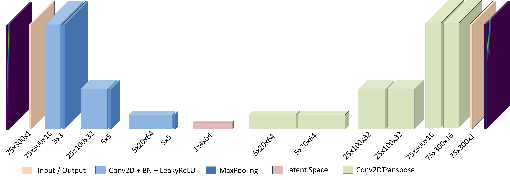
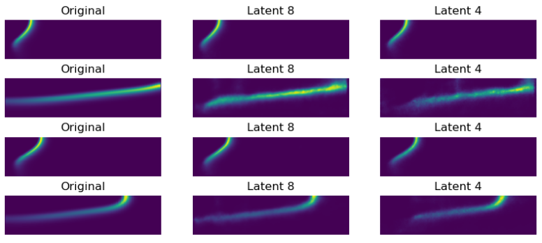

# Autoencoding Kolmogorov Flow Snapshots

This repository provides a modular deep learning pipeline for compressing and reconstructing 2D Kolmogorov flow fields using convolutional autoencoders (AEs) and mapping physical parameters to the latent space with fully connected neural networks (FCNNs).

---

## Overview

- **Goal:** Compress and reconstruct CFD snapshots of Kolmogorov flow at different Reynolds numbers using autoencoders, and enable fast generation of flame fields from physical parameters.
- **Methods:** Convolutional autoencoder (CAE) with systematic hyperparameter tuning, and FCNN mapping from physical conditions to AE latent vectors.
- **Dataset:** 2D velocity fields (U, V) at Re = 20, 30, 40, all resized to 24×24 for model input.
- **Network Structure:**  
  

---

## Project Structure


```
your-project/
├── data/               # Raw & preprocessed flow data
├── models/             # Autoencoder architectures
├── utils/              # Data loading & helpers
├── scripts/            # Train/evaluate scripts
├── checkpoints/        # Saved model weights
├── requirements.txt
└── README.md
```

---

## Getting Started

### 1. Install dependencies

```bash
conda create -n ae-flow python=3.10
conda activate ae-flow
conda install numpy=1.26 scipy matplotlib pandas seaborn scikit-learn meshio
pip install tensorflow
pip install -r requirements.txt
```

### 2. Prepare your data

- Place `.npy` or `.vtk` files in `./data` folder. (See `utils/dataloader.py` for format.)

### 3. Run main scripts

```bash
python scripts/train.py           # Train autoencoder
python scripts/evaluate.py        # AE reconstruction results
python scripts/train_mapping.py   # Train FCNN mapping network
python scripts/evaluate_mapping.py

```

---
## Hyperparameter for Autoencoder (Summary Table)

| Parameters       | 1.Train | 2.Train | 3.Train   | 4.Train      | ***5.Train***   | 6.Train      |
|------------------|---------|---------|-----------|--------------|-----------------|--------------|
| Batch size       | 16      | 8       | 8         | 8            | ***8***         | 4            |
| Learning rate    | 1e-3    | 1e-4    | 1e-4      | 1e-4         | ***1e-4***      | 1e-5         |
| Activation       | ReLU    | ReLU    | LeakyReLU | LeakyReLU    | ***LeakyReLU*** | LeakyReLU    |
| Normalization    | None    | None    | None      | BatchNorm    | ***BatchNorm*** | BatchNorm    |
| Latent dimension | 4       | 4       | 4         | 4            | ***8***         | 8            |
| Others           | default | default | default   | default      | ***default***   | default      |



## Key Results

- The convolutional autoencoder (CAE) achieves efficient compression and high-quality reconstruction of Kolmogorov flow snapshots from DNS data.

- The fully connected neural network (FCNN) successfully maps physical parameters to the AE latent space, enabling fast and plausible generation of steady-state fields.

- Hyperparameter tuning (batch size, learning rate, activation, normalization, latent dimension) significantly affects reconstruction quality and mapping accuracy.

- For detailed results and discussions, see script outputs and figures.
---

## Reference

- If you use this code or build upon it, please cite related literature (see References in source code or your publication).
- Key background references:  
    - Karniadakis et al., Nature Reviews Physics, 2021  
    - Lusch et al., Nature Communications, 2018  
    - Milano & Koumoutsakos, J. Comput. Phys., 2002  
    - Morimoto et al., Theor. Comput. Fluid Dyn., 2021

---

## Contact

Maintainer: Qianshun Zhu  
Email: qianshun.zhu@campus.tu-berlin.de

---

*Pull requests and issues are welcome!*
